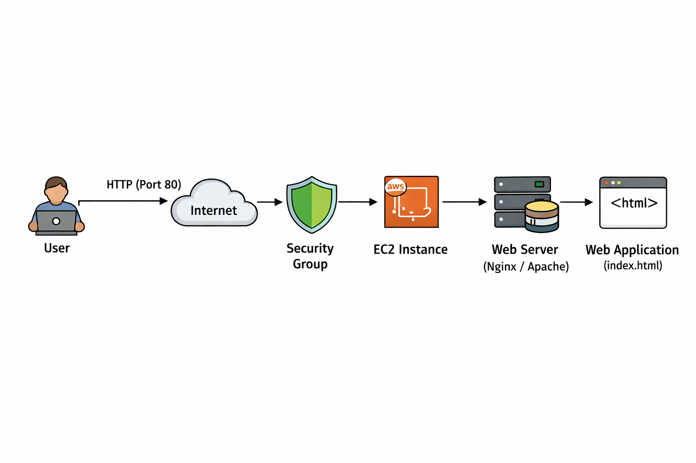

## AWS EC2 Web Application Deployment

## Overview

This project demonstrates the deployment of a simple web application on AWS EC2 using core cloud services and security best practices. The objective of this project is to gain hands-on experience with AWS infrastructure, networking, access control, and application deployment in a real-world cloud environment.

## Architecture

The architecture consists of an AWS EC2 instance launched within a VPC and secured using Security Groups. The application is hosted on the EC2 instance using a web server and accessed via the instance’s public IP address.

---

## Tech Stack

- AWS EC2  
- AWS IAM  
- AWS VPC  
- Security Groups  
- Linux (Amazon Linux)  
- Nginx / Apache Web Server  

---

## Implementation Steps

1. Created an IAM user with permissions limited to EC2 and networking services, following the least privilege principle.
2. Configured AWS CLI for secure programmatic access.
3. Launched an EC2 instance within a VPC using an appropriate subnet.
4. Created and configured Security Groups to allow:
   - SSH access (port 22) from trusted IPs
   - HTTP access (port 80) for web traffic
5. Generated and used an SSH key pair to connect securely to the EC2 instance.
6. Installed and configured a web server on the EC2 instance.
7. Deployed a simple web application on the server.
8. Verified application accessibility using the EC2 public IP.
9. Stopped the EC2 instance after testing to avoid unnecessary costs.

---

## Security Considerations

- Avoided using the AWS root account for daily operations.
- Applied the principle of least privilege to IAM user permissions.
- Restricted inbound traffic using Security Groups.
- Used SSH key-based authentication instead of password-based login.

---

## Challenges & Solutions

- **SSH connection failure**
  - Cause: Port 22 was not allowed in the Security Group.
  - Solution: Updated Security Group rules to allow SSH from a trusted IP range.

- **Web application not accessible**
  - Cause: HTTP traffic was not permitted.
  - Solution: Enabled port 80 in the Security Group and restarted the web server.

---

## Outcome & Learnings

- Gained hands-on experience with AWS EC2, IAM, and VPC concepts.
- Understood cloud networking, security groups, and access control.
- Learned how to deploy and troubleshoot applications in a cloud environment.
- Developed confidence in managing cloud resources securely and efficiently.

---

## Future Improvements

- Automate infrastructure provisioning using Terraform.
- Add a CI/CD pipeline for automated deployments.
- Improve av
