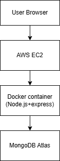
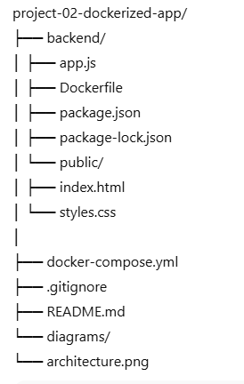

# Project 02 – Dockerized Backend Application with MongoDB Atlas

## 📌 Overview
This project demonstrates how to containerize a Node.js backend application using **Docker and Docker Compose**, connect it to **MongoDB Atlas (cloud database)**, and deploy it on an **AWS EC2 instance**.

The application supports **credit and debit transactions** and stores transaction history persistently in MongoDB.

This project focuses on **real-world DevOps skills**, including containerization, environment variable management, cloud database connectivity, and production debugging.This project simulates a production-like backend deployment workflow commonly used in real-world cloud-native application.

---

## 🏗 Architecture



The backend application runs inside a Docker container on an AWS EC2 instance and securely connects to MongoDB Atlas over the internet using environment variables.

## 🛠 Tech Stack
- **Backend:** Node.js, Express.js  
- **Database:** MongoDB Atlas  
- **Containerization:** Docker, Docker Compose  
- **Cloud Platform:** AWS EC2 (Ubuntu)  
- **Version Control:** Git & GitHub  


## ✨ Features
- Credit and Debit transactions
- Automatic balance calculation
- Transaction history tracking
- Cloud-hosted database using MongoDB Atlas
- Environment-based configuration using `.env`
- Fully containerized backend
- Deployed and tested on AWS EC2


## 📂 Project Structure




## 🔐 Environment Variables

Create a `.env` file **(do not commit to GitHub)**:

```env
MONGODB_URI=mongodb+srv://<username>:<url_encoded_password>@<cluster>.mongodb.net/transactiondb
PORT=3000
⚠️ Important Notes

MongoDB passwords containing special characters must be URL-encoded

.env file is excluded using .gitignore

MongoDB Atlas IP whitelist must allow the EC2 instance

## 🐳 Docker Configuration

Build and Run Containers
docker-compose up --build

Stop Containers
docker-compose down
View Logs
docker logs transaction-backend

## ☁️ Deployment on AWS EC2
Steps

Docker was installed directly on the EC2 instance, and the application was deployed without any managed services to demonstrate low-level infrastructure understanding.

Launch an Ubuntu EC2 instance

Install Docker and Docker Compose

Clone the GitHub repository

Create .env file on EC2

Run:

docker-compose up -d


Access the application:

http://<EC2_PUBLIC_IP>:3000

Security Group

Allow inbound traffic on port 3000

Source: 0.0.0.0/0 (for learning purposes)

##  🧪 API Endpoints

Method	Endpoint	Description
GET	      /	        Load UI
POST	/credit	    Add credit transaction 
GET	    /balance	Get current balance
GET	     /history	Get transaction history

## 🧠 Troubleshooting & Key Learnings

Debugged Docker container crashes using docker logs

Resolved MongoDB Atlas authentication issues caused by special characters in passwords

Learned how Mongoose buffers operations when DB connection fails

Identified and fixed application-level runtime errors

Understood the importance of environment variable injection in containers


## 🚀 Future Enhancements

Enable AWS SQS with IAM roles

Add CI/CD using GitHub Actions

Add Docker health checks

Deploy using Kubernetes

Add Nginx reverse proxy

👩‍💻 Author

Nima Manoharan
Aspiring Cloud & DevOps Engineer
