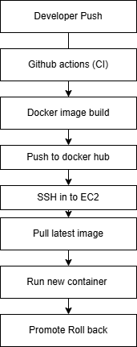

# 🚀 Project 03 – CI/CD Pipeline with GitHub Actions & Docker (EC2 Deployment)
## 📌 Project Overview

This project demonstrates a complete CI/CD pipeline for a containerized Node.js application using GitHub Actions, Docker, Docker Hub, and AWS EC2.

The pipeline automatically:

Builds a Docker image on every code push

Pushes the image to Docker Hub

Deploys the latest image to an EC2 instance

Performs health checks

Rolls back automatically if the deployment is unhealthy

This project reflects real-world DevOps practices used in production environments.
## 🏗️ Architecture Diagram

## 🛠️ Tech Stack Used
Category	                Tools
CI/CD	                    GitHub Actions
Containerization	        Docker
Image Registry	            Docker Hub
Cloud	                    AWS EC2
Runtime	                    Node.js
Database	                MongoDB Atlas
OS	                        Ubuntu

## Project Structure

## 🔄 CI/CD Workflow Explanation
### 1️⃣ Continuous Integration (CI)

Triggered on every push to the master branch.

Steps:

Checkout source code

Build Docker image

Push image to Docker Hub

### 2️⃣ Continuous Deployment (CD)

After a successful build:

SSH into AWS EC2

Pull latest Docker image

Deploy container

Perform health check

Roll back automatically if unhealthy

## ⚙️ GitHub Actions Workflow (docker-ci.yml)

Key stages in the workflow:

Docker Hub authentication

Image build (no cache)

Image push

Secure EC2 deployment via SSH

Health check validation

Rollback handling

Secrets are securely managed using GitHub Actions Secrets.

## 🔐 Secrets Used (GitHub Actions)
Secret Name	               Purpose
DOCKER_USERNAME	          Docker Hub username
DOCKER_PASSWORD	          Docker Hub password
EC2_HOST	              EC2 public IP
EC2_USER	              SSH user (ubuntu)
EC2_SSH_KEY	              EC2 private key

## GET /health

Returns:

{
  "status": "ok"
}
Docker Health Check

HEALTHCHECK --start-period=40s --interval=30s --timeout=5s --retries=3 \
  CMD curl -f http://localhost:3000/health || exit 1
Docker monitors the container internally and reports:

healthy

unhealthy

## 🔁 Rollback Strategy
To avoid downtime and broken deployments:

New container is started with a temporary name

Health check is validated

If healthy → new container replaces old one

If unhealthy → new container is removed and old one continues running

This ensures safe deployments with automatic rollback.

## 🚀 Deployment Verification
Check container status:

docker ps

View logs:

docker logs transaction-backend

Access application:

http://<EC2_PUBLIC_IP>:3000

## 🧠 Key DevOps Learnings
Docker image immutability

Secure secret management

Automated CI/CD pipelines

Health-based deployment validation

Rollback strategies

Debugging real production issues

## 🔮 Possible Enhancements
Blue-Green deployment

Nginx reverse proxy

Load balancer integration

Kubernetes deployment

Infrastructure provisioning with Terraform

## 👩‍💻 Author
Nima Manoharan
Aspiring Cloud & DevOps Engineer